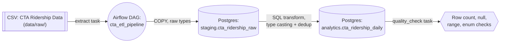
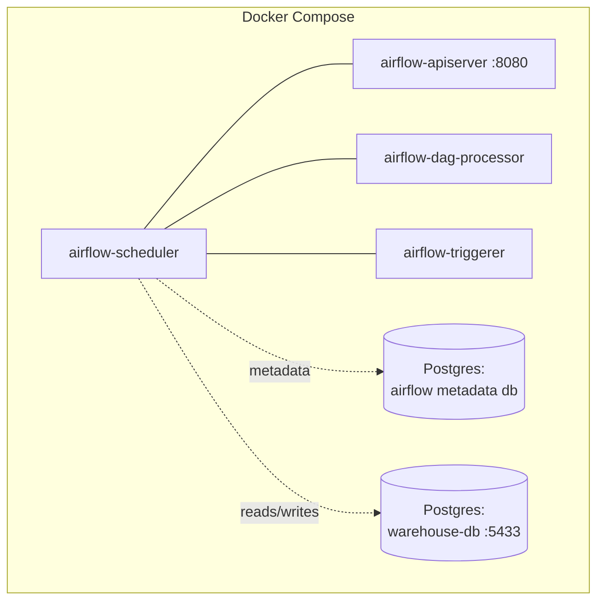

# CTA-ETL-Pipeline

A local, containerized ETL pipeline built with **Docker**, **Apache Airflow 3.3.0**, and **PostgreSQL**, processing Chicago Transit Authority (CTA) 'L' Station ridership data — 1.3M+ daily entries per station, spanning 2001–2025.

## Overview

This project demonstrates a full extract → stage → transform → validate pipeline pattern, orchestrated by Airflow and running entirely on Docker Compose. It's a companion, beginner-to-intermediate portfolio project alongside a production-style AWS (S3/Glue/Athena) version of a similar pipeline.

## Architecture





## Tech Stack

- **Orchestration:** Apache Airflow 3.3.0 (LocalExecutor — no Celery/Redis, single-machine parallelism)
- **Storage:** PostgreSQL 16 (two instances — one for Airflow's own metadata, one as the data warehouse)
- **Transform:** SQL (no dbt at this stage — kept intentionally simple for this project's scope)
- **Language:** Python 3 (pandas for extraction)
- **Infra:** Docker Compose

## Pipeline Stages

1. **Extract** — reads the raw CSV, logs shape and a sample row
2. **Load to staging** — bulk-loads via Postgres `COPY` into `staging.cta_ridership_raw`, columns kept as loosely-typed text (no cleaning yet)
3. **Transform** — casts types (real `DATE`, integer `rides`), decodes `daytype` into a readable label, and writes to `analytics.cta_ridership_daily`
4. **Data quality checks** — row count sanity, null checks on key columns, no negative ride counts, `daytype` enum validation. The DAG fails loudly if any check fails.

## A Real Data Quality Decision

The source data contains **618 station-date pairs with duplicate, conflicting ride counts** (e.g., station 40300 on 2011-07-01 reports both 920 and 915 rides — likely a preliminary-vs-corrected reporting artifact from CTA). Rather than arbitrarily picking one, the transform step **averages and rounds** the conflicting values, treating both as independent estimates of the same true count. This is a documented, deliberate choice — not a silent one.

## Project Structure

```
CTA-ETL-Pipeline/
├── dags/               # Airflow DAG definitions
├── sql/
│   ├── staging/        # DDL for the raw landing table
│   └── transform/      # DDL + transform logic for the analytics table
├── data/raw/           # Source CSV (gitignored — not committed)
├── docker/             # Custom Airflow image (Dockerfile, requirements.txt)
├── tests/              # (planned)
├── docs/               # (planned)
├── docker-compose.yaml
├── .env
└── README.md
```

## Running Locally

**Prerequisites:** Docker, Docker Compose, git

```bash
git clone https://github.com/<your-username>/CTA-ETL-Pipeline.git
cd CTA-ETL-Pipeline
# place the CTA ridership CSV at data/raw/cta_ridership_daily.csv
docker compose build
docker compose up airflow-init
docker compose up -d
```

Airflow UI: [http://localhost:8080](http://localhost:8080) (login `airflow` / `airflow`). Unpause and trigger `cta_etl_pipeline`.

## Scheduling

The DAG runs on a daily cron (`0 6 * * *`), mirroring how a live-updating data source would be handled in production. Since this particular dataset is a static historical export rather than a continuously updating feed, the daily schedule demonstrates the *pattern* rather than pulling genuinely new data each run.

## Reliability

- **Retries:** each task retries twice, 5 minutes apart, before failing
- **`max_active_runs=1`:** prevents overlapping runs from corrupting the truncate-and-reload pattern
- **Failure callback:** logs an alert on task failure — the hook point where Slack/email/PagerDuty integration would go in a production deployment

## Status

✅ Complete — extract, stage, transform, quality-check, scheduling, and retries all implemented and verified end-to-end.
